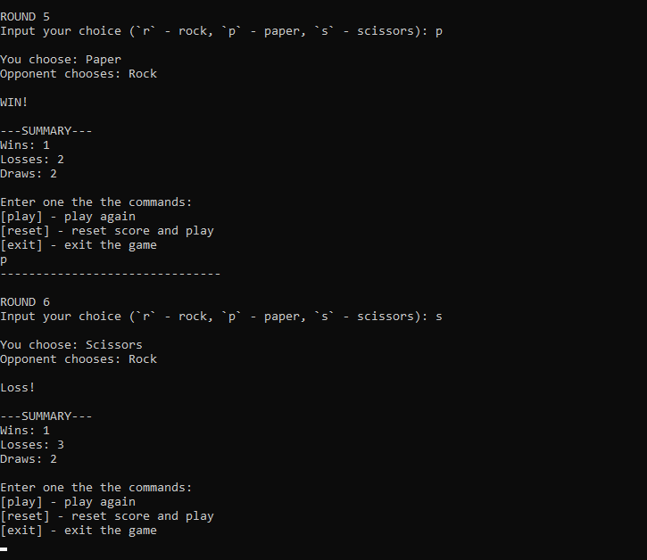

# RockPaperScissors
## A version of the well-known Rock Paper Scissors hand game.
#### Developed by [Ivan "John Ivess" Shyika](https://www.youtube.com/c/JohnIvess) in C++ for practice

## Demo

---

I practiced:
- Including static libraries (the `rps` project is a static library containing all the game-related values, variables, and methods)
- Using namespaces
- Template methods
- Enumerations
- Fixing pseudorandomness
